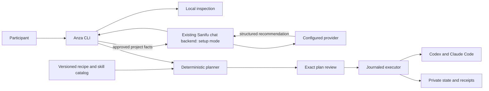

# Anza architecture

## Components and trust boundary

Anza is one Go program, `cmd/anza`, on the participant machine. Its hosted interview is an extension of the existing `sanifu-run/chat` Go server, not another executable or deployment. The CLI uses the standard flag package and injected input/output. Keep inspection, local planning, repair and removal usable when chat is unavailable. See ADR 006 for the founder-directed reuse decision and contracts/v1.md revision 2 for the cross-repository seam.

The LLM never supplies executable commands, downloads, filesystem destinations, credentials or approval decisions. Treat interview replies, imported briefs, repository names and provider output as untrusted data. Project files are not automatically uploaded. Recommendation validation rejects IDs outside the catalog and unsupported platform combinations.

## Package ownership

- `internal/domain`: shared value types and pure validation. Imports standard library only.
- `internal/catalog`: embedded signed-release content and schema validation. Imports domain.
- `internal/platform`: OS and tool detection; never installs.
- `internal/state`: workspace identity, private files, atomic state and locks.
- `internal/process`: bounded process execution and cancellation; no implicit shell.
- `internal/download`: verified downloads and archive extraction.
- `internal/configedit`: lossless supported configuration edits, conflict detection and rollback patches.
- `internal/planner`: pure conversion from facts/recommendations/registry to operations.
- `internal/executor`: operation journal, replay classification and receipts.
- `internal/adapters/codex`, `internal/adapters/claude`: native agent configuration and launch plans.
- `internal/credentials`: participant key store; values never appear in domain types.
- `internal/launch`: agent child process environment assembly.
- `internal/doctor`, `internal/exercise`, `internal/lifecycle`: readiness, project checks, updates and removal.
- `internal/interviewclient`, `internal/cli`: hosted interview and terminal flows.
- Existing `chat` root package: `server`, `answerWithPrompt`, shared model transport, `Conversation`, `transcriptStore`, DynamoDB CAS, recovery-token auth, routes and runtime Secrets Manager loading. Add setup policy/handlers/state/quota files in that same package. Backend files never import local installer/executor packages.
- `catalog/{recipes,packs,skills,exercises}`: reviewed data and original/adapted instruction assets.

Use context.Context first for I/O, wrap errors with context, inject clocks/processes/transports at consumer boundaries, and keep fakes in test files. The private chat module is not a Go dependency of the public CLI; exchange versioned wire fixtures and a reviewed catalog metadata artifact. Shared types precede dependent work. Root go.mod/go.sum, schemas, shared types, CI entrypoints and command wiring each have one assigned owner per task. Dependency additions go through the coordinator.

## Dependency decisions

Prefer standard library. Explicit CLI exceptions: a TOML parser/editor library where required for syntax-safe Codex edits; OS credential-store support; Go x/term for masked input and x/sys only when required for process/ACL primitives. Pin reviewed versions in the foundation task with evidence; no wildcard/latest dependency additions by workers. Do not add a CLI framework, UI framework, ORM or generic workflow engine. The backend retains its existing AWS SDK and provider transport; no second database engine or provider library is introduced.

## Persistent state

User data belongs in the OS user config/state roots (XDG overrides on Linux, Application Support on macOS, LocalAppData on Windows). Workspace ID is a hash of canonical path plus filesystem identity; detect moves/case normalization without sending paths to the server. Sensitive directories are private, POSIX 0700/0600 or owner-only Windows ACLs. Local locks cover workspace writes and shared tool installation separately; acquisition order is user-tool lock then workspace lock.

State stores plan digest, recipe versions, operation journal, before/after file hashes, protected backups, owned keys/files and outcome classifications. State never stores OpenRouter keys, subscription tokens or shell environment dumps. Project-local `.anza/config.json` contains only nonsecret profile/provider selections and catalog references; ask before modifying ignore rules in an existing repo. The CLI recovery token and resume metadata stay in private user state; submitted interview answers are stored by the shared backend under its disclosed policy; export requires review.

File operations use write-temp, flush and platform-safe replace, with mode/ACL preservation. If the current file hash differs from the approved preimage, stop and replan. Refuse symlink/reparse escapes, case-fold collisions and targets outside explicit roots. Journal before external effects. Process/package installs are not globally transactional: after a crash inspect the real installed state, then mark success, retry only if proven idempotent, or request manual reconciliation. Never claim automatic rollback of a system package install.

## Agent configuration

Direct folder delivery is the initial content mechanism: namespaced `anza-*` skills under project `.agents/skills` and `.claude/skills`, generated from one pack source. Managed copies avoid requiring Windows symlink privileges. Detect already shared/symlinked roots to avoid duplicate edits. Preserve existing skills and unrelated config; conflict means skip with an actionable report, not overwrite.

Global agent install is per-user using qualified vendor methods. Project behavior and provider choices use supported project/profile/launch settings as verified in the compatibility matrix. Ordinary native launches remain available for subscription mode. `anza run codex` and `anza run claude` provide a stable entry for keychain-backed OpenRouter credentials and mixed provider choices. Explain this in the wizard. Do not delete vendor login credentials, automatically log out a participant, change provider endpoints globally, or grant blanket trust/permission bypass.

## Reused hosted interview

Anza calls the existing Sanifu API origin. The backend keeps one shared server process, model/client/secret routing, DynamoDB transcript store, Lambda image and Pulumi stack. Existing website APIs remain backward compatible. Source evidence is in research/chat-reuse.md; current per-instance limits must not be described as a distributed spend cap.

Add immutable conversation purpose (`setup`; absent means legacy intake) and optional setup context/recommendation metadata. The native CLI uses the existing random 64-hex X-Conversation-Token and requestId protocol. Server storage uses the existing SHA256 token-derived ID. There is no new invitation scheme, bearer session service or subscriber credential forwarding. A CLI token is generated fresh; browser recovery tokens are never harvested. Existing website conversations remain intake unless a future explicit handoff feature is separately designed.

Add setup start/context/capability/recommendation handlers. `/api/ask` continues to carry interview turns and `/api/conversation` restores/deletes the session. Dispatch setup-purpose turns through a setup prompt/policy using common reservation/completion and model helpers. Preserve existing intake prompts, contact behavior, citations, title generation, brief approval and booking semantics. Setup tokens cannot invoke booking, brief approval or title mutation. A valid current setup recommendation is distinct from a learner-approved workshop brief and from local install approval.

The existing `answerWithPrompt` combines transport and citation processing. Extract its raw model exchange once inside chat, keeping legacy wrappers. Setup structured output uses that shared raw exchange without citation rewriting; validated recommendation JSON is returned only by the dedicated recommendation endpoint. CLI/server pin the same recommendation catalog digest through a generated reviewed metadata artifact. No arbitrary client URL/content catalog is trusted and there is no runtime private-module import.

Keep `allow`/`active` limits shared. Add durable setup admission/reservation records in a small coordination table within the existing Pulumi stack, using the current AWS SDK. This avoids mixing budget rows into transcript scans/mail. Limits are setup-specific and persistent across instances; legacy intake retains its existing controls unless a separate reviewed change expands accounting. Overall provider credit caps remain independently configured. Unknown provider outcomes retain their reservation and are never retried automatically just because a conversation lease expired.

`ANZA_SETUP_ENABLED` defaults false. Capability probing reports support without a paid call. Absent setup table/caps/catalog yields setup unavailable while the existing chat health and intake remain operational. Deploy additive backend capability first, verify legacy behavior and supported catalog, then publish the CLI. Rollback disables setup first; do not remove shared transcripts or replace the existing API origin.

## Shared data policy

Reuse the configured AWS transcript retention and provider policy. Current source/deployment record describes 30-day AWS expiry after updates, provider capture outside that limit and separate owner email copies. The plan does not promise a new 24-hour or anonymous service. New setup conversations are excluded from scheduled owner email by default; absent purpose preserves legacy intake mail behavior. Owner access to setup summaries is explicit and authenticated.

Existing conversation deletion removes active setup context/recommendation with the transcript and invokes optional setup coordination cleanup. Minimal non-content budget/replay tombstones may remain until their disclosed TTL. Provider copies are outside that deletion. Anza reviews a minimized machine-facts/brief payload before sending; raw project files, browser tokens, customer records and participant agent credentials are never uploaded. Optional learner-selected brief text/file import remains available without repurposing a live website conversation.

## Recovery and readiness

Statuses: ready, action_required, manual, unsupported, blocked, failed, unknown. Check each layer independently: executable present/version supported; config valid; provider selected; login/key available; paid live request verified or unverified; exercise checked. Overall workshop readiness requires all mandatory checks or explicitly reported human steps. Redacted diagnostics include versions, status codes and operation IDs, never raw config or interview text.
